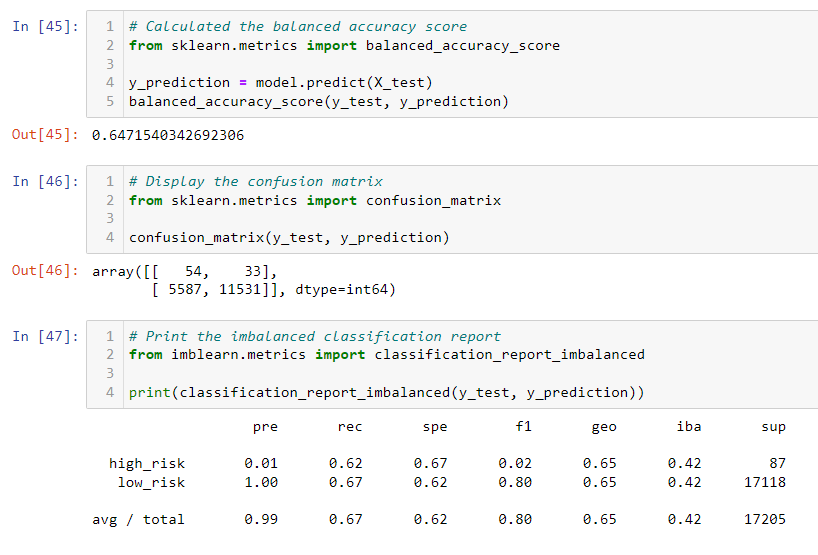
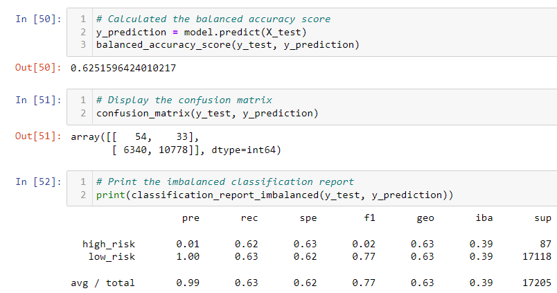
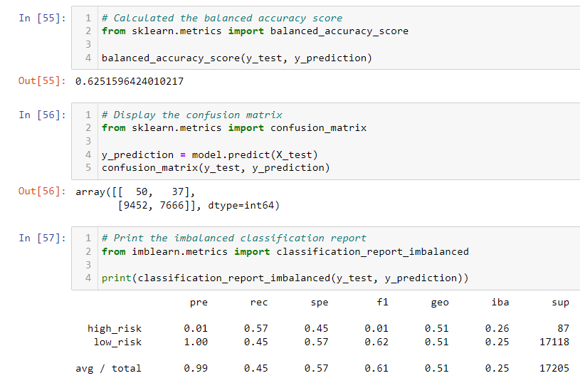
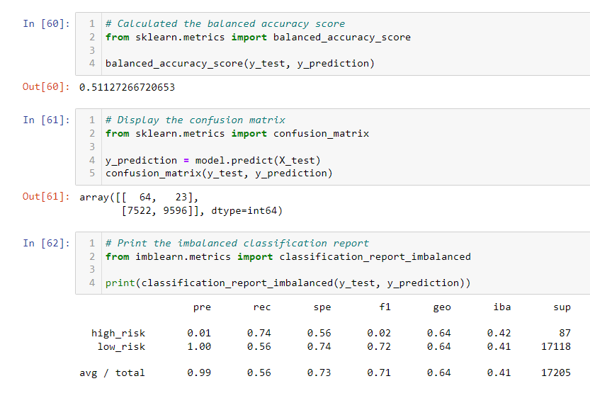
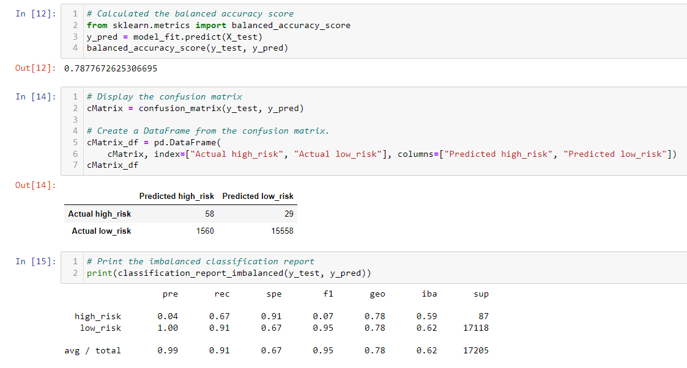
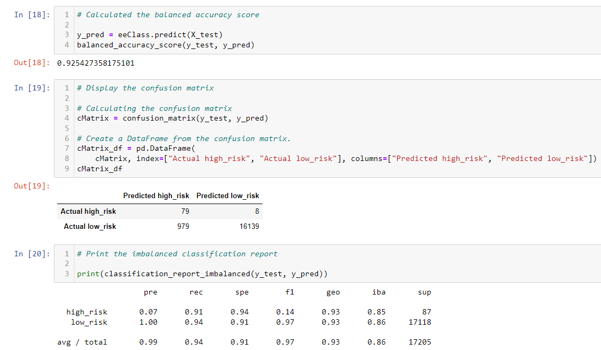

# credit_risk

## Overview

The purpose of this project is to demonstrate how to use several different models in order to predict credit risk and evaluate their effectiveness. This includes:

- Resampling Models: RandomOverSampler, SMOTE algorithms, and ClusterCentroids algorithms
- SMOTEENN algorithms
- Ensemble Classifiers: BalancedRandomForestClassifier and EasyEnsembleClassifier 

## Results

### RandomOverSampler

- Balanced Accuracy Score: 65%
- Precision: 99%
- Recall Score: 67%

### SMOTE

- Balanced Accuracy Score: 63%
- Precision: 99%
- Recall Score: 63%

### ClusterCentroids

- Balanced Accuracy Score: 63%
- Precision: 99%
- Recall Score: 45%

### SMOTEENN

- Balanced Accuracy Score: 51%
- Precision: 99%
- Recall Score: 56%

### BalancedRandomForestClassifier

- Balanced Accuracy Score: 79%
- Precision: 99%
- Recall Score: 91%

### EasyEnsembleClassifier

- Balanced Accuracy Score: 93%
- Precision: 99%
- Recall Score: 94%

